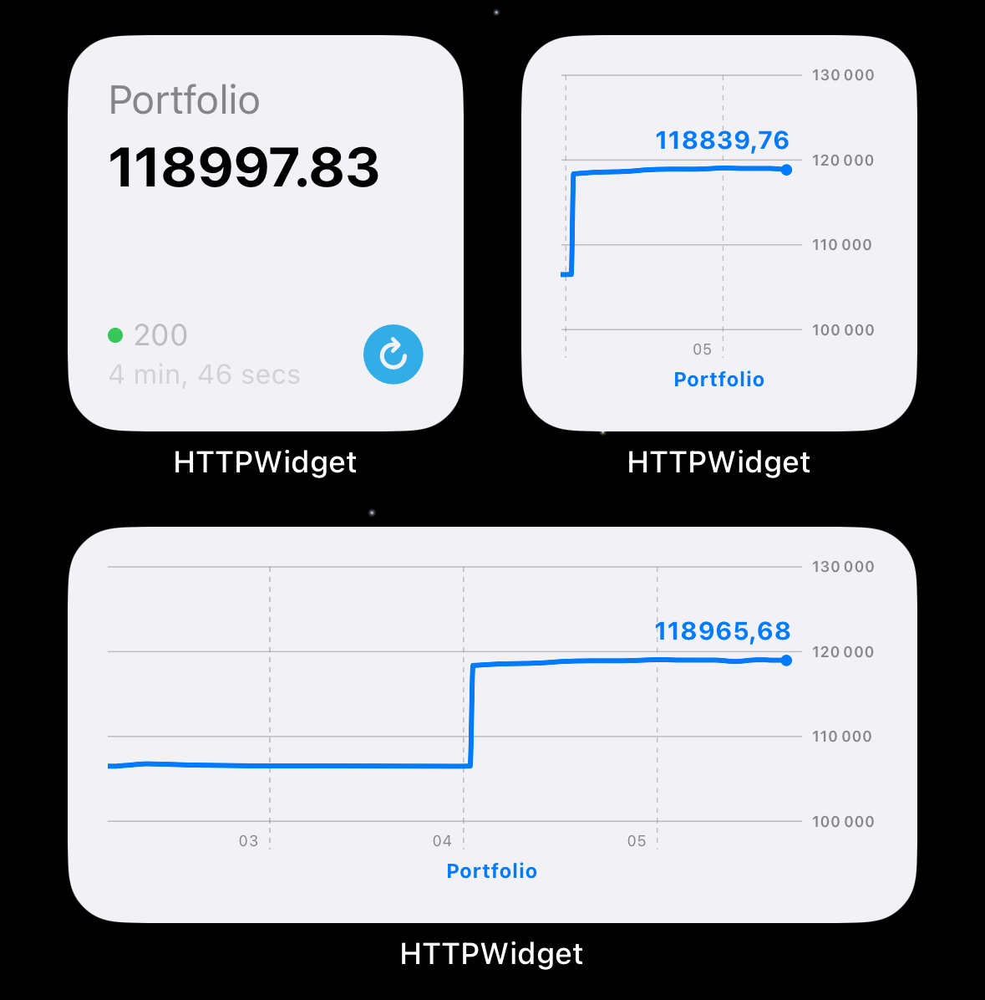

# portfolio-performance-sync

Track your portfolio performance account and get real-time data via api and widgets.



## Project

This project offers a real-time API to monitor your investment portfolio using data from Portfolio Performance and live market prices.

Highlights:

- Real-time portfolio valuation with automatic USD/EUR conversion
- Market data refreshed every 5 minutes via Yahoo Finance
- Secure API access using API keys
- JSON responses for easy integration
- Health check endpoint for API monitoring

Built with FastAPI, it processes your Portfolio Performance XML export and enriches it with current market data for accurate, up-to-date tracking.

### Widget Integration

You can display your portfolio value directly on your iOS device using HTTPWidget:

1. Install [HTTPWidget](https://apps.apple.com/th/app/httpwidget/id6447097633) from the App Store
2. Configure a new widget with your API endpoint
3. Add your API key in the headers
4. Select the JSON path to display (e.g., `summary.total_portfolio_value`)
5. Add the widget to your home screen for real-time portfolio monitoring

## Development

Add your `portfolio.xml` file to the root of the project.

```bash
# Install dependencies
pip3 install -r requirements.txt

# Verify your holdings
python3 script.py USD

# Run the API
python3 run_api.py

# Get your portfolio in USD or EUR
curl -X GET "http://localhost/api/portfolio?base_currency=USD" -H "X-API-Key: key"
```

## Deploy

### Deploy to Render

1. Create a free account on [Render](https://render.com)
2. Create a new Web Service
3. Upload your `portfolio.xml` file to the repo Github (private repo for privacy)
4. Connect your GitHub repository
5. Configure the service:

   - Build Command: `pip install -r requirements.txt`
   - Start Command: `uvicorn api.main:app --host 0.0.0.0 --port $PORT`
   - Add your environment variables:
     - `PORT`: 80
     - `X_API_KEY`: Your API key
     - `API_KEY_NAME`: X-API-Key

6. Deploy!

Your API will be available at https://your-app-name.onrender.com

You can use [fastcron.com](https://fastcron.com) to schedule a job to run every 10 minutes to keep your API alive and avoid sleep on the Health Check.

## API

### Get Portfolio (USD or EUR)

```bash
curl -X GET "http://localhost/api/portfolio?base_currency=USD" -H "X-API-Key: key"

# Example response
{
  "summary": {
    "base_currency": "USD",
    "total_portfolio_value": 1000.00,
    "total_cost_basis": 900.00,
    "total_profit_loss": 100.00,
    "profit_loss_percentage": 10.00
  },
  "last_updated": "2025-05-13T10:10:09.467928"
}
```

### Health Check

```bash
curl -X GET "http://localhost/api/health"

# Example response
{
  "status": "ok"
}
```
